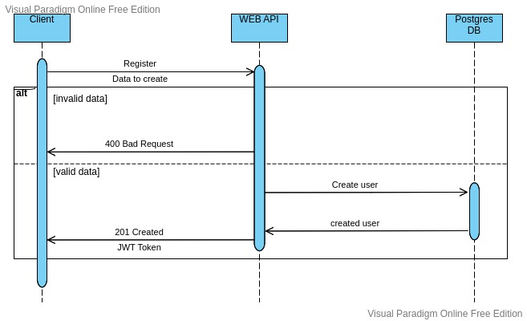
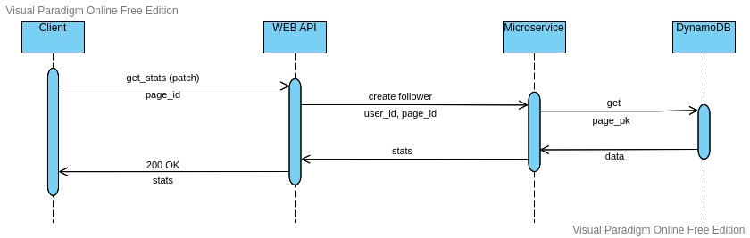
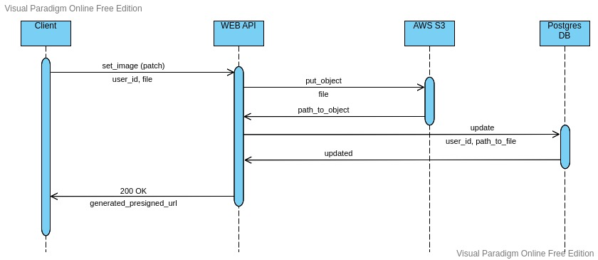

# Sequence Diagrams

# Contents
1 [Register](#1)  
2 [Follow_page](#2)  
3 [Get stats of page](#3)  
4 [Set image of user](#3)  

<a name="1"/>

# 1 Register

<a name="2"/>

# 2 Follow page
.jpeg)

<a name="3"/>

# 3 Get stats of page

# 4 Set image of user
