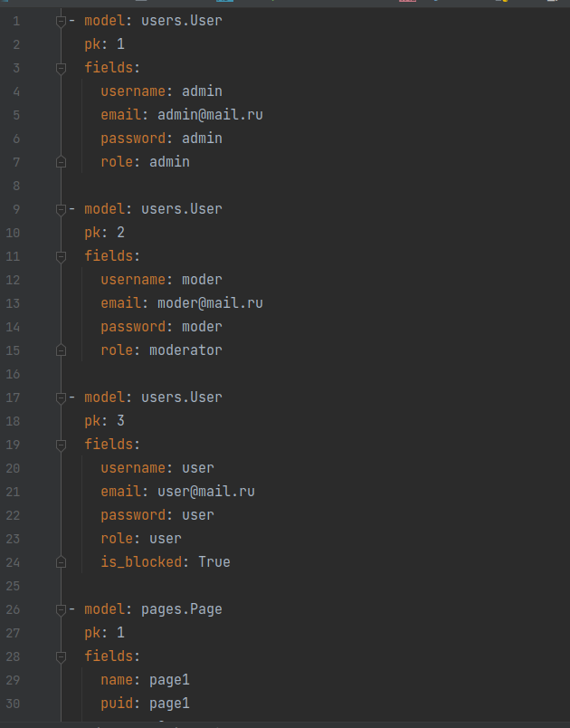
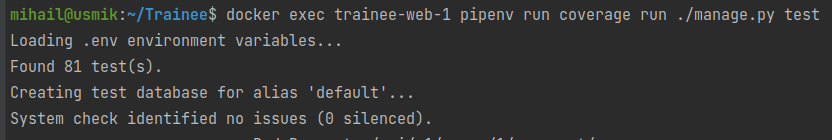
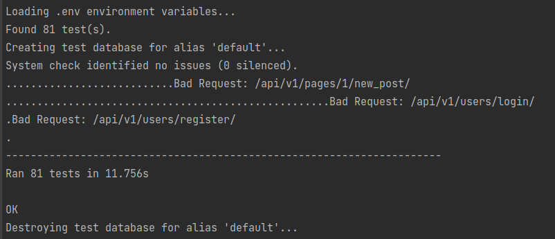
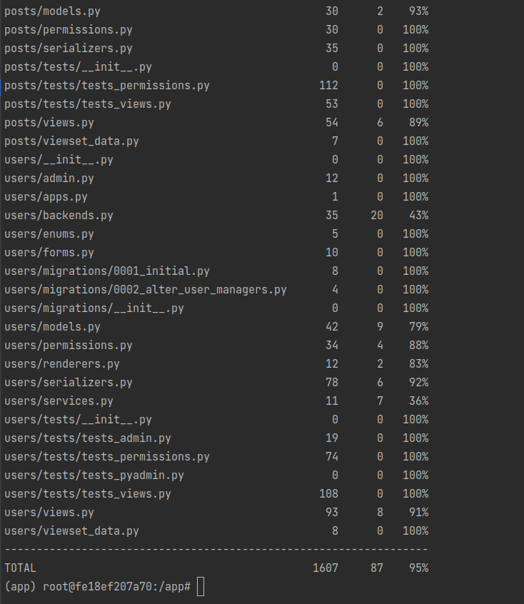
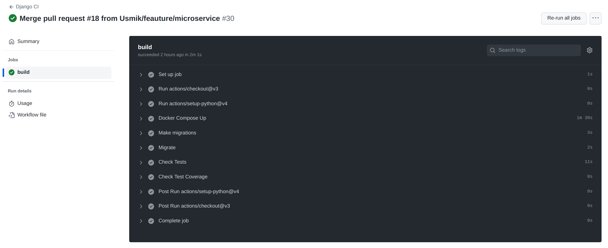

Тест-план "UsmItter".

### Содержание
  1. [Введение](#1)
  2. [Объект тестирования](#2)
  3. [Атрибуты качества](#3)
  4. [Риски](#4)
  5. [Аспекты тестирования](#5)
  6. [Подходы к тестированию и их реализация](#6)
  7. [Представление результатов](#7)
  8. [Выводы](#8)

### 1. Введение

Данный план предназначен для тестирования API "UsmItter".
Цели тестирования:
1. Предоставление информации о качестве ПО конечному заказчику;
2. Повышение качества ПО;
3. Предотвращение появления дефектов.

### 2. Объект тестирования

Тестированию подлежат все функции, которые не были созданы автоматически фреймворками. 
При тестировании API проверяется его:
	- полнота: должны выполняться все заявленные функции
	- корректность: выполнение функций должно проходить корректно

### 3. Атрибуты качества

Атрибутами качества будут являться:
1. Высокий процент покрытия тестами(>90%)
2. Безошибочное прохождение всех тестов.

### 4. Риски
Риском является не 100% покрытие кода тестами. Хотя даже такое покрытие не гарантирует правильную работу приложения.

### 5. Аспекты тестирования

Тестирование API включает в себя:

1. Unit-тесты
2. Функциональное тестирование
3. Интеграционное тестирование

Юнит тестирование проводится для тестирования отдельных блоков или компонентов приложения в полной изоляции.
Функциональное тестирование — тестирование некого функционала продукта, при этом продукт воспринимается как единый «чёрный ящик».
Интеграционное тестирование проводится для тестирования работы взаимодействия отдельных компонентов приложения.

Для предотвращения ошибок была использована практика разработки программного обеспечения - Непрерывная Интеграция (CI, англ. Continuous Integration).
Заключающаяся в выполнении автоматизированных сборок проекта для скорейшего выявления потенциальных дефектов и решения интеграционных проблем.

Для реализации CI были использованы возможности GitHub, а именно GitHub Actions.
Github Actions — это управляемый событиями инструмент непрерывной интеграции и непрерывной доставки, который позволяет автоматизировать процесс создания, тестирования и развертывания приложений в различных средах. Под управляемым событиями подразумевается, что рабочий процесс действий Github запускается в ответ на событие, которое происходит в вашем репозитории Github, например запрос на push, merge и т. д.

### 6. Подходы к тестированию и их реализация

Тестирование API осуществляется с помощью интсрументов, предоставляемых фреймворками, с помощью которых был реализован продукт.
В первую очередь были написаны Unit-тесты для блоков кода, которые могут быть ими протестированы.
Для написания тестов активно использовался такой инструмент как "Faker", который автоматически случайным образом генерирует необходимые слова или предложения.

При написании функциональных и интеграционных тестов использовались так называемые "Фикстуры". 
В которых предварительно объявляются данные для записи в тестовую БД.
Запись данных осуществляется автоматически инструментом, выбранным для создания тестов.

Использование "Faker" и "Фикстур" является хорошим тоном в тестировании прогнаммного обеспечения. 

Для каждой из моделей было протестировано каждое из разрешений, позволяющих пользователю выполнять те или иные действия.

Важным аспектом является реализованная Непрерывная Интеграция, срабатывающая при каждом изменении файлов в репозитории. 
[CI](../Code/.github/workflows/ci.yml)

Для запуска тестов необходимо предварительно запущенное в докере приложение.
В контейнере с самим приложением необходимо ввести команду: 
##### ./manage.py test 
Которая использует функционал фреймворка для автоматического обнаружения тестов для каждой из моделей, их запуск и остлеживание.

### 7. Представление результатов

Успешный запуск тестов выглядит подобным образом:

Помимо сообщении об успешном прохождении всех тестов можно получить информацию о покрытии элементов программы тестами введя команду:
#### coverage report

Результат этой команды:

Как можно видеть на представленном скриншоте, реализованное API имеет практически полное покрытие тестами - 95%.

Корректность работы приложения характеризуется безошибочным прохождением "пайплайнов". Которые запускаются автоматически при каждом изменении кода.

### 8. Выводы
Тестовый план демонстрирует тестирование функционала приложения. 
Успешное прохождение тестов всё ещё не может гарантировать полное отсутствие ошибок в работе приложения, но сводит риск их появления к минимуму. 