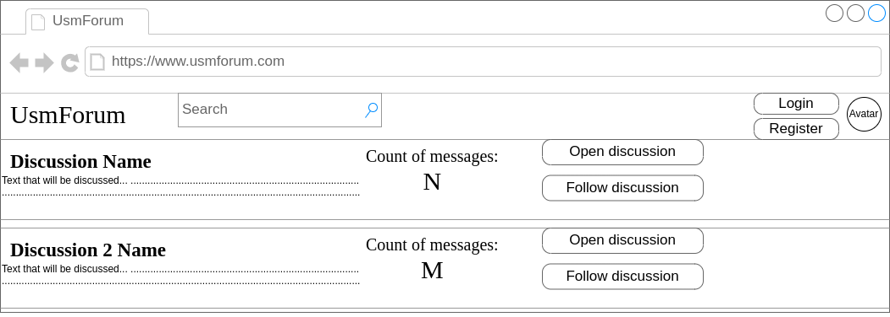
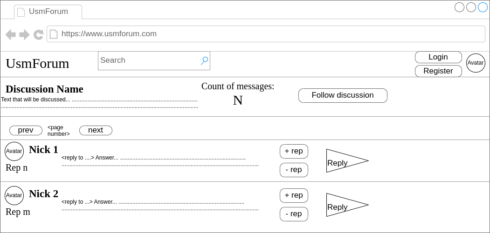

# Software Requirements Specification
## For UsmForum

Version 1.0  
Prepared by Usmanov Mihail    

Table of Contents
=================
* 1 [Введение](#1-introduction)
* 2 [Требования пользователя](#2-требования-пользователя)
  * 2.1 [Программные интерфейсы](#21-программные-интерфейсы)
  * 2.2 [Интерфейс пользователя](#22-интерфейс-пользователя)
  * 2.3 [Характеристики пользователей](#23-характеристики-пользователей)
* 3 [Системные требования](#3-системные-требования)
  * 3.1 [Функциональные требования](#31-функциональные-требования)
  * 3.2 [Нефункциональные требования](#32-нефункциональные-требования)

## 1. Введение
> Название продукта - UsmItter.

Проект представляет собой аналог API социальной сети. При создании проекта, автор вдохновлялся таким проектом как "Twitter".

Проект позволяет пользователям зарегистрировать пользователя, создать одну или несколько страниц для пользователя.
На страницах владелец может создавать записи. Под записью другие пользователи могут делиться своим мнением, оставлять свои реакции, но реакции будут созданны как новая запись на странице автора реакции.

## 2. Требования пользователя

### 2.1 Программные интерфейсы
Для осуществления всех возможностей продукт будет активно взаимодействовать с AWS Сервисами, в частности это DynamoDB, Simple Storage Service, Simple Email Service. Также продуктом используются возможности Celery и RabbitMQ.

### 2.2 Интерфейс пользователя
Так как продукт является API для социальной сети, то интерфейсом будут служить 'конечные точки'(endpoints), получить которые можно с помощью реализованного в продукте Swagger'a. К таким эндпоинтам будут относиться например: '/user/login/', '/user/register/', '/posts/<post_pk>/'. Благодаря возможностям, предоставляемым Сваггером, все эндпоинты указываются вместе с типом действия, которое они принимают: "post", "get", "put" и т.д. Также Сваггер предоставляет возможность посмотреть, какие данные следует указать, для конкретного эндпоинта. 
Пользователям предоставлена возможность поиска страниц по названию/id/тэгу страницы, а также поиск других пользователей по имени и никнейму.

Пример подробного просмотра обсуждения, который включает в себя возможность просмотреть все ответы пользователей, итерироваться по страницам ответов, оценивать ответы пользователей, при этом каждая оценка будет влиять на репутацию пользователя, а также возможность отвечать на ответы других пользователей.

### 2.3 Характеристики пользователей
Пользователи разбиваются на три основные группы:
1. Администраторы
2. Модераторы
3. Пользователи

У всех пользователей имеется отображаемое имя, почта, аватар, описание и т.д.

В соответствией с группой, к которой пользователь принадлежит, он обладает теми или иными правами и возможностями. 
Кроме базовых возможностей, которыми обладают все пользователи, и которые будут описаны в разделе функциональных требований, администраторам и модераторам предоставляются дополнительные возможности:
1) Администратор имеет возможность просмотра любых страниц, в том числе приватных и заблокированных, блокировать пользователей на любой промежуток времени, блокировать страницы пользователей, удалять страницы и посты.
2) Модератор имеет возможность просмотреть приватные страницы, блокировать страницы и удалять посты.

## 3. Системные требования

### 3.1 Функциональные требования
Проект должен предоставлять возможности для:
1. Регистрации пользователей.
2. Авторизации пользователей.
3. Создания/редактирования/удаления страниц.
4. Возможность подписаться на страницы других пользователей в том числе с получением уведомлений о новых записях.
5. Показывать статистику о пользователе (количество подписчиков, количество лайков, количество постов).
6. Возможность оставлять комментарии на записи других пользователей.
7. Проверять расширение загружаемых файлов.
8. Пользователь должен иметь возможность сделать страницу приватной.
9. На приватные страницы может быть отправлен запрос на подписку.
10. Владельцы приватных страниц должны иметь возможность принять или отклонить запрос на подписку, или сразу все запросы.
11. Пользователи должны иметь возможность лайкнуть/анлайкнуть посты.
12. Пользователи должны иметь возможность посмотреть посты, которые были лайкнуты пользователем.
13. Блокировать все страницы пользователя, если он был заблокирован.

### 3.2 Нефункциональные требования
1. Версия Python 3.10 и выше.
2. Версия Django 4.0 и выше.
3. Само приложение на Django + Django Rest Framework.
4. Для статистики – NoSQL бд, а именно – AWS DynamoDB.
5. Для хранения всех фото, используется AWS S3.
6. Для уведомление, а именно email сообщений – AWS SES, который вызывается с помощью worker’a Celery.
7. Связь микросервиса с основным приложением через брокер сообщений - RabbitMQ.
8. В качестве базы данных для core приложения – PostgreSQL.
9. Для формирования статистики – отдельный микросервис на FastAPI.
10. На время разработки, основное приложение, база данных, микросервис и все необходимые сущности поднимаются в Docker.
11. Аутентификация пользователей с помощью JWT токенов.
